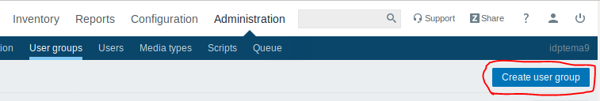
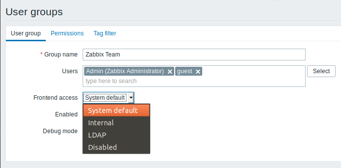
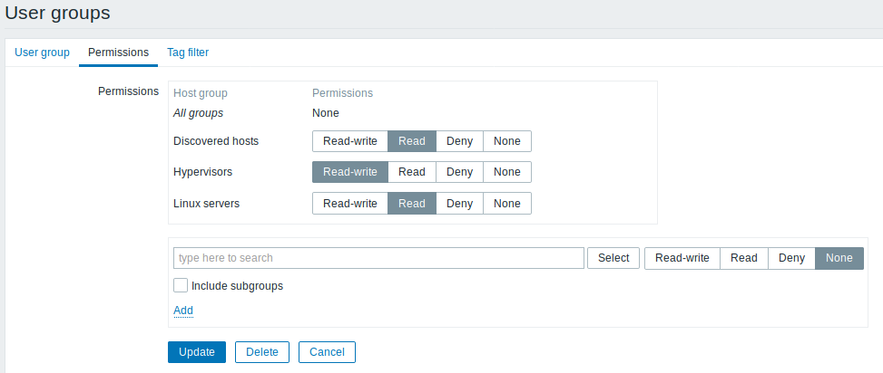
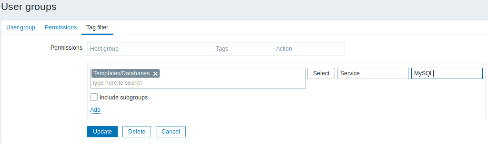

# zabbix
## Creación de grupos
Para crear un grupo de usuario accedemos a Administration → User Groups 
Clickeamos sobre “Create user group”

Ponemos el nombre del grupo, los usuarios y “Frontend access” que es para establecer cómo se van a autenticar los usuarios del grupo

En la pestaña permisos permite especificar el acceso del grupo de usuarios a los datos del grupo de hosts, hemos añadido 2 permisos de lectura y 1 de escritura

El filtro de etiquetas permite separar el acceso al grupo de hosts de la posibilidad de ver problemas.
Por ejemplo, si un administrador de la base de datos necesita ver solo los problemas de la base de datos "MySQL", primero se debe crear un grupo de usuarios para los administradores de la base de datos, que especifique el nombre de la etiqueta "Servicio" y el valor "MySQL".

