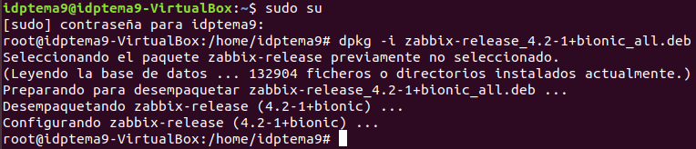

# Trabajo idp tema 9 
## Hecho por: 

Instalación de Zabbix en Ubuntu 18.04, descargamos la última versión del programa utilizando el comando 

`wget https://repo.zabbix.com/zabbix/4.2/ubuntu/pool/main/z/zabbix-release/zabbix-release_4.2-1+bionic_all.deb`

Descomprimimos y ejecutamos el programa

Actualizamos los repositorios 

