# Trabajo idp tema 9 
## Hecho por: 

Instalación de Zabbix en Ubuntu 18.04, descargamos la última versión del programa utilizando el comando.

`wget https://repo.zabbix.com/zabbix/4.2/ubuntu/pool/main/z/zabbix-release/zabbix-release_4.2-1+bionic_all.deb`

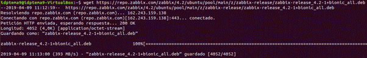

Descomprimimos y ejecutamos el programa.

Actualizamos los repositorios.

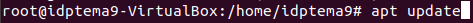

Instalamos el servidor de Zabbix.

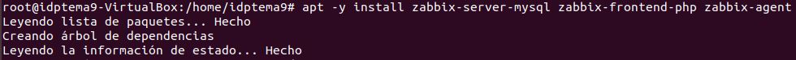

Creamos la base inicial ejecutando MariaDB.

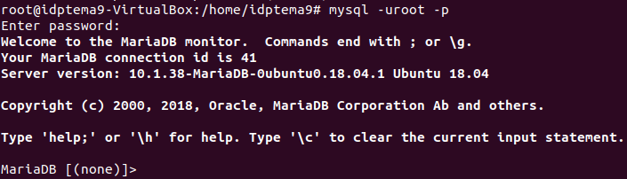

Especificamos "UTF-8" (codificación de caracteres unicode en iso) como predeterminado.

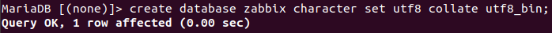

Damos los privilegios de administración.

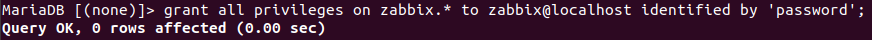

Cerramos MariaDB con "quit".

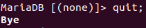

Importamos el esquema inicial y los datos, para ello utilizaremos la contraseña antes creada.

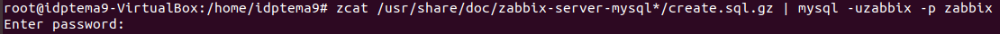

Utilizando la herramienta nano editamos el fichero “/etc/zabbix/zabbix_server.conf”.

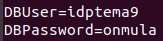

Editamos el fichero “/etc/zabbix/apache.conf” para especificar nuestra zona horaria.

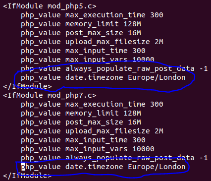

Reiniciamos el servidor Zabbix y el agente de procesos.

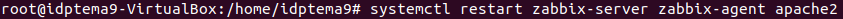

Hacemos que el servidor Zabbix inicie en el arranque

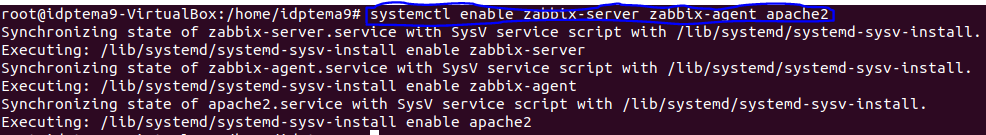

Ya estaría completado el proceso de instalación, ahora lo iniciamos escribiendo “http://localhost/zabbix”  en el buscador.

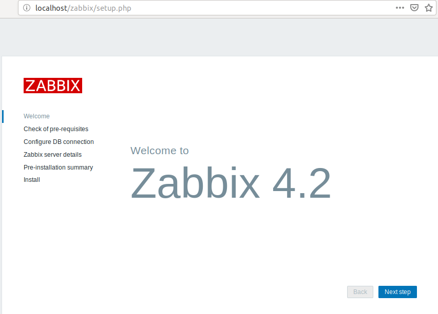

El programa va a comprobar los requisitos.

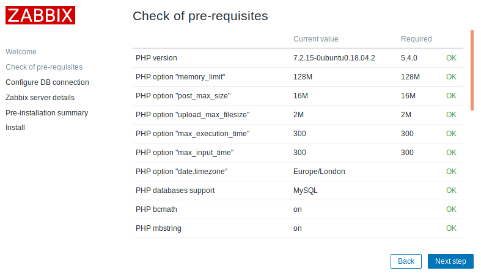

Ponemos el nombre de la base de datos, el usuario y la contraseña.

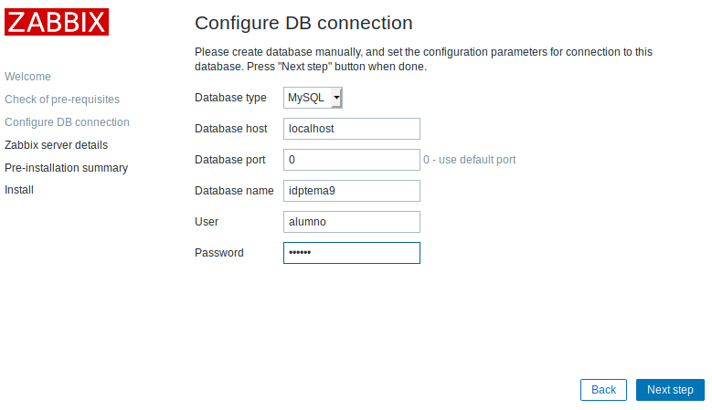

Asignamos el nombre de la base de datos.

Esto es todo lo que vamos a instalar.

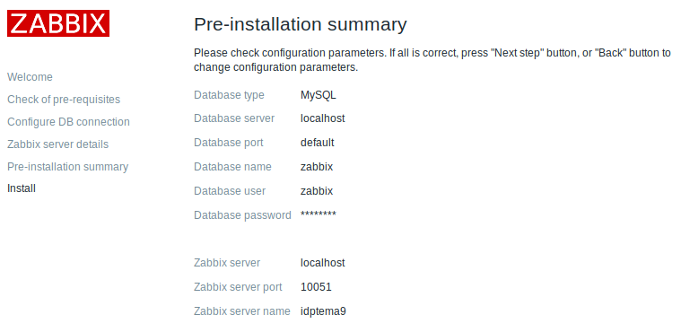

Se nos creará el fichero que podremos editar "/usr/share/zabbix/conf/zabbix.conf.php".

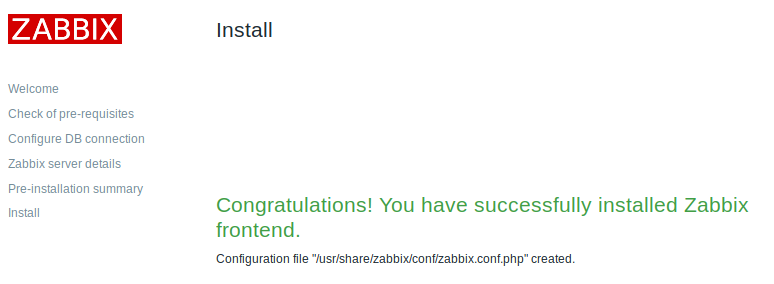

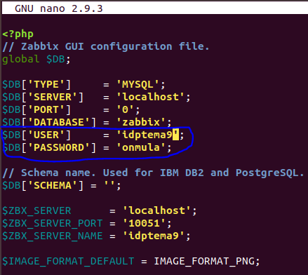

Iniciamos sesión en el programa con usuario Admin y contraseña zabbix.

