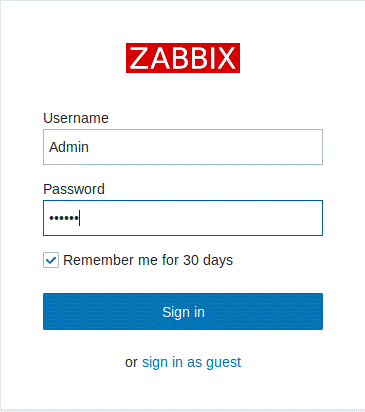

# Trabajo idp tema 9 

## Hecho por:

1º Instalación de Zabbix en Ubuntu 18.04, descargamos la última versión del programa utilizando el comando.

`wget https://repo.zabbix.com/zabbix/4.2/ubuntu/pool/main/z/zabbix-release/zabbix-release_4.2-1+bionic_all.deb`

2º Descomprimimos y ejecutamos el programa.

3º Actualizamos los repositorios.

4º Instalamos el servidor de Zabbix.

5º Creamos la base inicial ejecutando MariaDB.

6º Especificamos "UTF-8" (codificación de caracteres unicode en iso) como predeterminado.

7º Damos los privilegios de administración.

8º Cerramos MariaDB con "quit".

9º Importamos el esquema inicial y los datos, para ello utilizaremos la contraseña antes creada.

10º Utilizando la herramienta nano editamos el fichero “/etc/zabbix/zabbix_server.conf”.

11º Editamos el fichero “/etc/zabbix/apache.conf” para especificar nuestra zona horaria.

12º Reiniciamos el servidor Zabbix y el agente de procesos.

13º Hacemos que el servidor Zabbix inicie en el arranque

14º Ya estaría completado el proceso de instalación, ahora lo iniciamos escribiendo “http://localhost/zabbix”  en el buscador.

15º El programa va a comprobar los requisitos.

16º Ponemos el nombre de la base de datos, el usuario y la contraseña.

17º Asignamos el nombre de la base de datos.

18º Esto es todo lo que vamos a instalar.

19º Se nos creará el fichero que podremos editar "/usr/share/zabbix/conf/zabbix.conf.php".

20º Iniciamos sesión en el programa con usuario Admin y contraseña zabbix.

