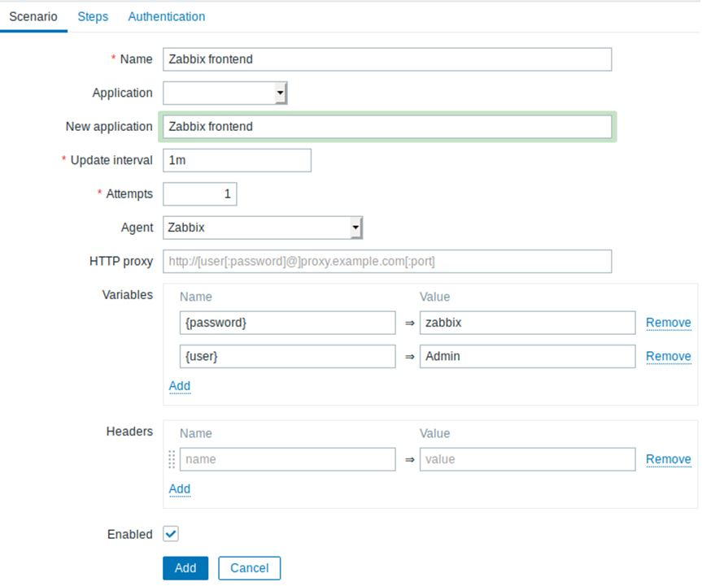
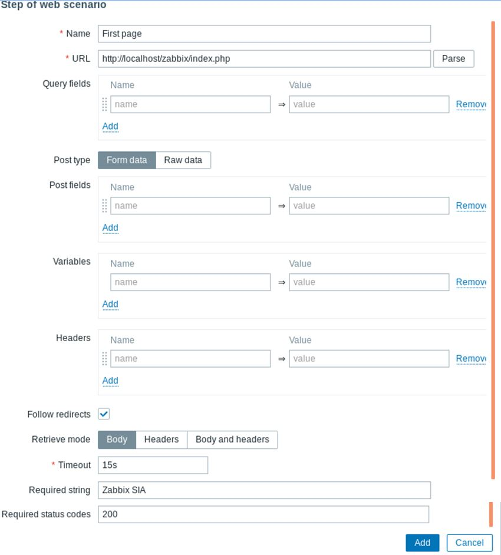
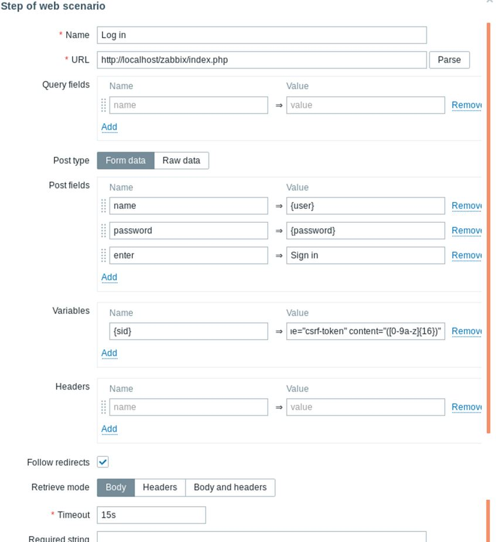
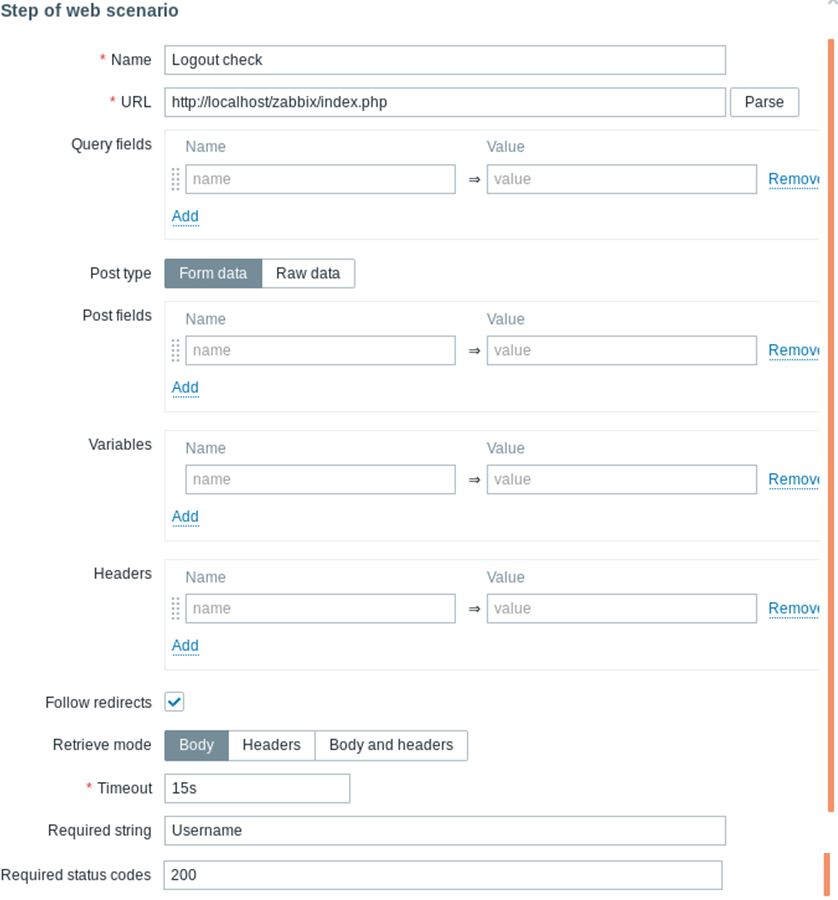
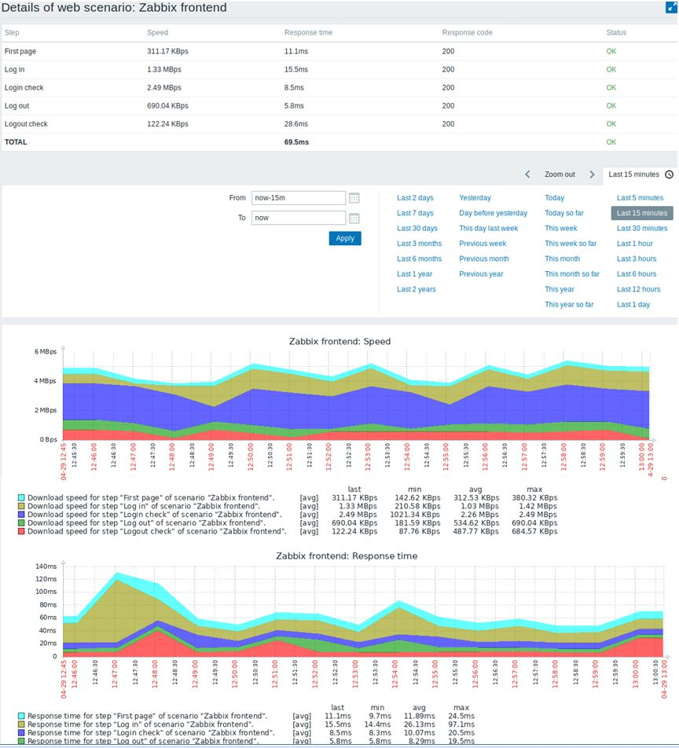

# zabbix
## Monitorización web
Usemos el monitoreo web de Zabbix para monitorear la interfaz web de Zabbix. Queremos saber si está disponible, proporciona el contenido correcto y con qué rapidez funciona. Para hacerlo, también debemos iniciar sesión con nuestro nombre de usuario y contraseña.
## Step 1:
Añadir un escenario
Vaya a Configuración → Hosts , elija un host y haga clic en Web. Luego haga clic en Crear escenario web

## Step 2:
Definir los pasos para el escenario.
El paso 1 sería este

El paso 2:
Continuamos iniciando sesión en la interfaz de Zabbix, y lo hacemos reutilizando las macros (variables) que definimos en el nivel de escenario: {usuario} y {contraseña}

Definimos tambien la expresión regular `regex:name="csrf-token" content="([0-9a-z]{16})"` que necesitaremos más tarde

Paso 3:
Al iniciar sesión, ahora debemos verificar el hecho. Para hacerlo, verificamos una cadena que solo sea visible cuando inicie sesión, por ejemplo, Administración

Paso 4:
Ahora que hemos verificado que se puede acceder a la interfaz y que podemos iniciar sesión y recuperar el contenido registrado, también debemos cerrar sesión; de lo contrario, la base de datos de Zabbix se contaminará con muchos y muchos registros de sesiones abiertas

Paso 5:
También podemos verificar que hemos cerrado sesión buscando la cadena de nombre de usuario .

Y así debería quedar el escenario de pasos:

## Step 3:
El escenario aparecerá en Monitorización → Web :

Haga clic en el nombre del escenario para ver estadísticas más detalladas:

