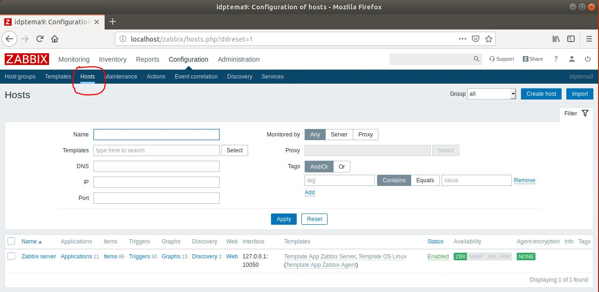
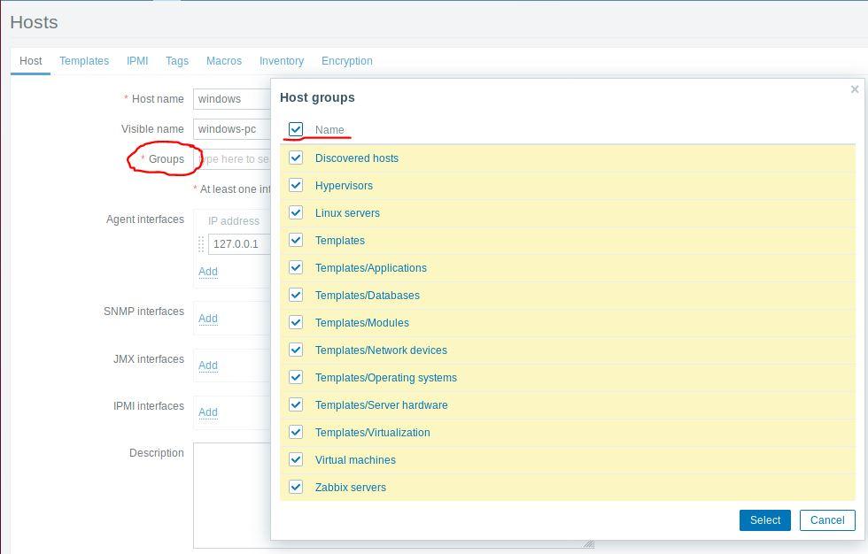
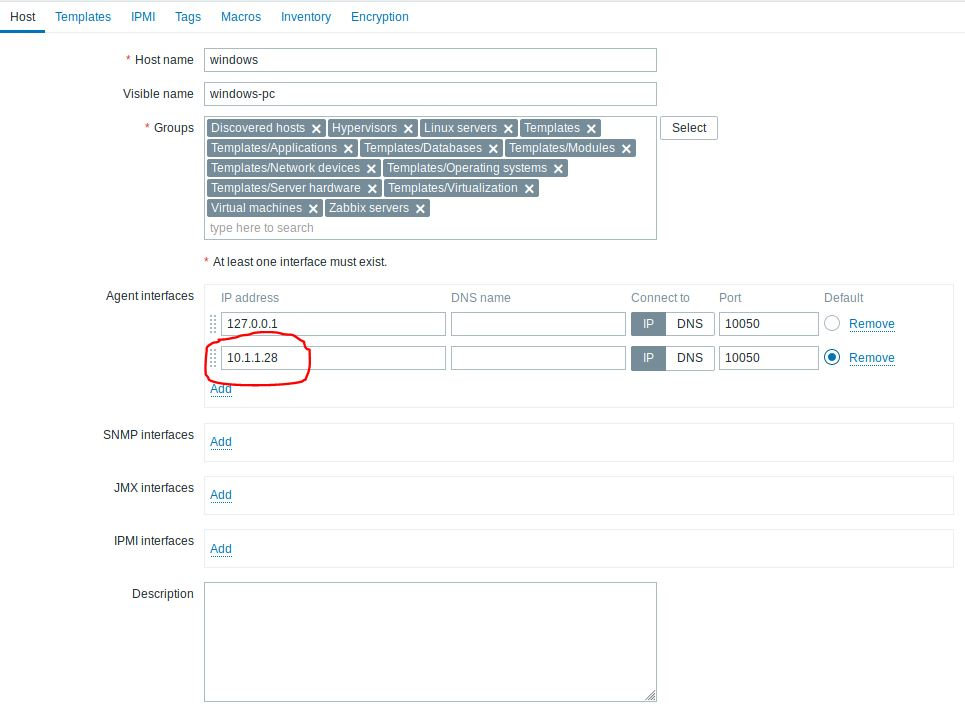
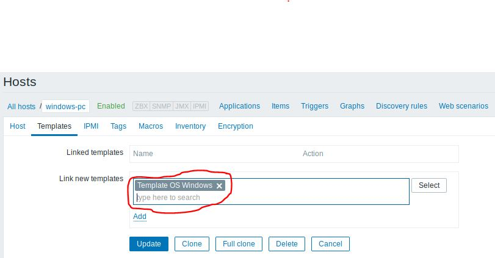
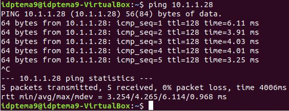
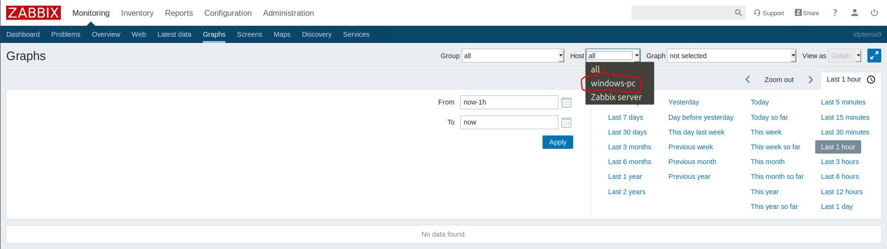
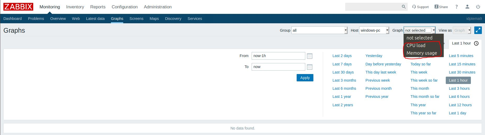
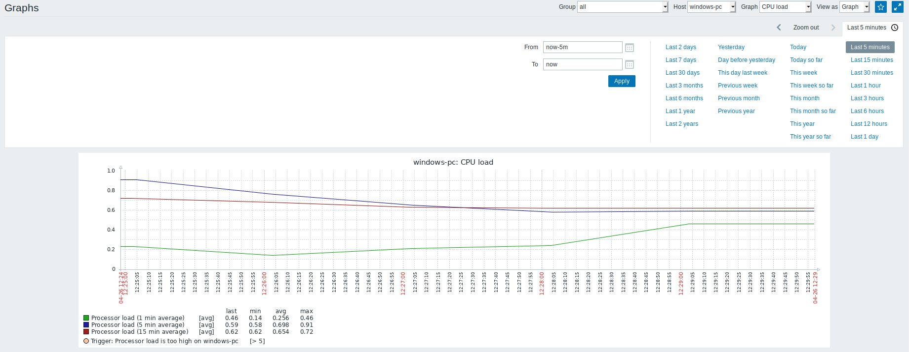
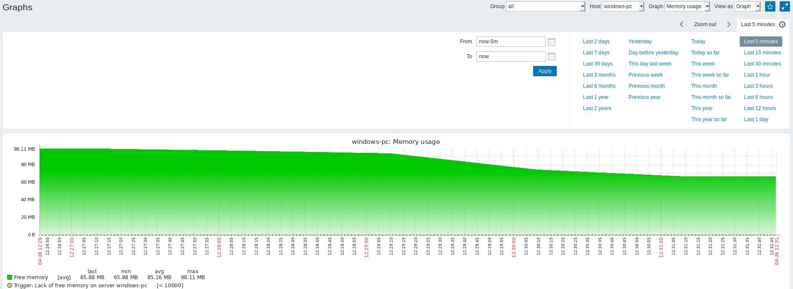

# Trabajo idp tema 9

## Creación de un host en Zabbix para monitorizar una máquina.

1º Entramos en Zabbix, nos vamos al apartado "configuration" y dentro de este entramos en el apartado "Host". 

2º Pulsamos en "create host" y empezamos a configurar el host. Ponemos un nombre en este caso "windows-pc" y en el apartado grupos añadimos todos los grupos.

3º En "Agent Interfaces" añadimos la IP del equipo que vamos a monitorizar, en este caso la IP será 10.1.1.28. Dejamos las demas opciones por defecto y de damos a "Add".

4º Entramos en el host que acabamos de crear y nos vamos a la pestaña de "Templates", buscamos el template "Windows OS", le damos a "add" y después a "update".

5º Para comprobar la conectividad del servidor con el cliente hacemos un `ping` al equipo del cliente.

6º Nos vamos a "Monitoring", y dentro de este pulsamos en Graphs, en "Host" seleccionamos windows-pc

7º En "Graph" tenemos dos opciones disponibles una para monitorizar la CPU (CPU Load) y otra para monitorizar la memoria (Memory usage). 

8º Vamos a seleccionar la opción de la CPU. Tenemos distintas opciones de tiempo disponibles, vamos a seleccionar .

9º Por últimos vamos a monitorizar el uso de memoria. Ya estaría la monitorización completada. 

