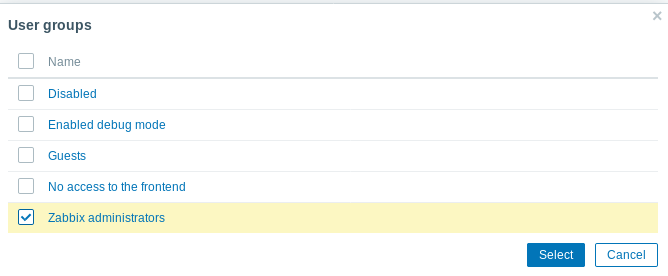

# Creación de Usuarios en Zabbix

1º En primer lugar vamos a crear un usuario en Zabbix, para ello vamos a Administration y le damos a users.

2º Le damos a “create user” y comenzamos a rellenar los campos, en este ejemplo añadiremos el usuario al grupo “Zabbix Administrators” por lo que el usuario tendrá permisos de administración.

3º Ya tendríamos el usuario creado.

