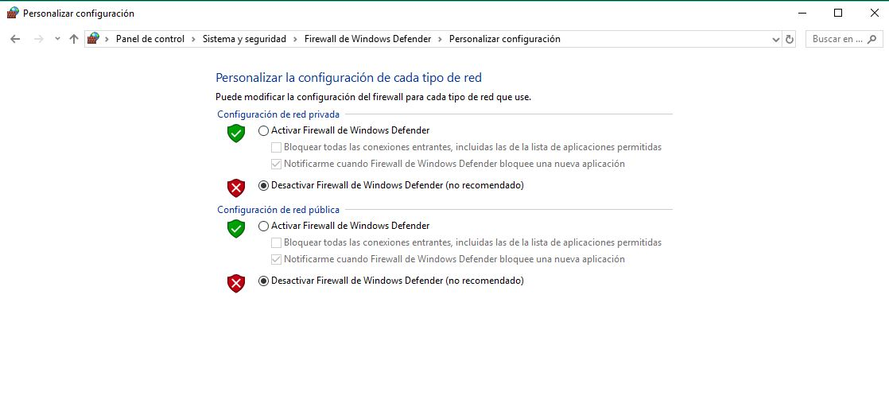

# Trabajo idp tema 9

## Instalacion del agente zabbix para poder monitorizar la maquina donde lo vamos a instalar

1º Entramos en la pagina oficial de Zabbix y nos vamos a descargas, hay elegiremos Zabbix Agents y elegimos la version para nuestro ordenador, y le damos a descargar. 

2º Nos vamos donde este el instalador y le damos doble click.

3º Le damos a next, y seguimos.

4º Aceptamos la licencia de zabbix.

5º Esta es la parte mas importante en la cual ponemos la ip de nuestro servidor zabbix y le damos al icono de Remote command, el resto viene por defecto aunque puedes cambiar el Host name.

6º Le damos a next, y seguimos.

7º Le damos al boton de instalar . 

8º Y le damos a finish.

9º Ahora bien para que el equipo y el servidor se puedan conectar bien sin ningun problema vamos a hacer un `ping` en el cmd poniendo la ip del servidor zabbix. 

10º Para que el ping se efectivo debemos desctivar el firewall de windows para que funcione, tras haber hecho el ping lo volvemos a activar. 

