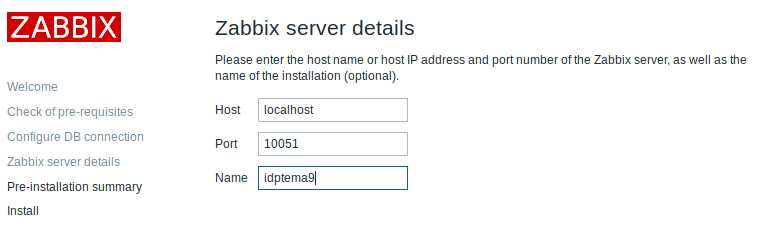

# Instalación del servidor Zabbix

Instalación de Zabbix 4.2.1 en Ubuntu 18.04:

1. Descargamos Zabbix:

  ```bash
  wget wget https://repo.zabbix.com/zabbix/4.2/ubuntu/pool/main/z/zabbix-release/zabbix-release_4.2-1+bionic_all.deb
  ```

2. Instalamos el paquete descargado antes:

	```bash
	sudo dpkg -i zabbix-release_4.2-1+bionic_all.deb
	```

3. Actualizamos los repositorios:

	```bash
	sudo apt update
	```

4. Instalamos otros paquetes necesarios para el servidor Zabbix:

	```bash
	sudo apt install -y zabbix-server-mysql zabbix-frontend-php zabbix-agent
	```

5. Conextamos al servidor de bases de datos:

	```bash
	mysql -uroot -p
	```

	> Nos pedirá la contraseña del administrador del gestor de bases de datos (`root`). Como lo acabamnos de instalar, lo dejamos vacío.

6. Creamos la base de datos:

  ```sql
  create dabatase zabbix character set uft8 collate utf8_bin;
  ```

7. Creamos al usuario `zabbix` con contraseña `password` y le damos todos los privilegios sobre la base de datos `zabbix`:

	```sql
	grant all privileges on zabbix.* to zabbix@localhost identified by 'password';
	```

8. Cerramos `mysql`:

	```sql
	quit;
	```

9. Importamos el esquema inicial y los datos, utilizando la contraseña antes creada:

	```bash
	zcat /usr/share/doc/zabbix-server-mysql*/create.sql.gz | mysql -uzabbix -p zabbix
	```

	> Nos pedirá la conttaseña del usuario `zabbix`.

10. Editamos el fichero `/etc/zabbix/zabbix_server.conf` y modificamos las siguientes propiedades:

	```ini
	DBUser=zabbix
	DBPassword=password
	```

11. Editamos el fichero `/etc/zabbix/apache.conf` para especificar nuestra zona horaria:

	```xml
	<IfModule mod_php5.c>
	    php_value max_execution_time 300
	    php_value memory_limit 128M
	    php_value post_max_size 16M
	    php_value upload_max_filesize 2M
	    php_value max_input_time 300
	    php_value max_input_vars 10000
	    php_value always_populate_raw_post_data -1
	    php_value date.timezone Europe/London			<--- añadir esta línea
	</IfModule>
	<IfModule mod_php7.c>
	    php_value max_execution_time 300
	    php_value memory_limit 128M
	    php_value post_max_size 16M
	    php_value upload_max_filesize 2M
	    php_value max_input_time 300
	    php_value max_input_vars 10000
	    php_value always_populate_raw_post_data -1
	    php_value date.timezone Europe/London			<--- añadir esta línea
	</IfModule>
	```

12. Reiniciamos el servidor y el agente Zabbix, y el servidor web Apache:

	```bash
	sudo systemctl restart zabbix-server zabbix-agent apache2
	```

13. Configuramos los servicios Zabbix para que se inicie automáticamente en el arranque:

	```bash
	sudo systemctl enable zabbix-server zabbix-agent apache2
	```

14. Ya estaría completado el proceso de instalación, ahora podemos acceder a la interfaz de Zabbix para administrarlo accediendo a la siguiente dirección [http://localhost/zabbix](http://localhost/zabbix)  en el navegador:


15. El configuración va a comprobar los requisitos:


16. Ponemos el nombre de la base de datos, el usuario y la contraseña:


> \* ¡OJO! En los pasos anteriores configuramos lo siguiente : "DatabaseName=zabbix", "User=zabbix", "Password=password".

17. Indicamos el nombre de la base de datos:



> \* ¡OJO! En los pasos anteriores configuramos lo siguiente : "Name=zabbix".

18. Nos muestra un resumen de la configuración que hemos establecido, y si es correcta, continuamos:


19. Se nos creará el fichero que podremos editar `/usr/share/zabbix/conf/zabbix.conf.php`:


> \* ¡OJO! Los parámetros de la captura anterior no se corresponden con la configuración que se ha establecido en esta guía.

20. Iniciamos sesión con el usuario "Admin" y contraseña "password".


