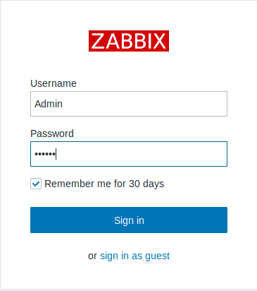
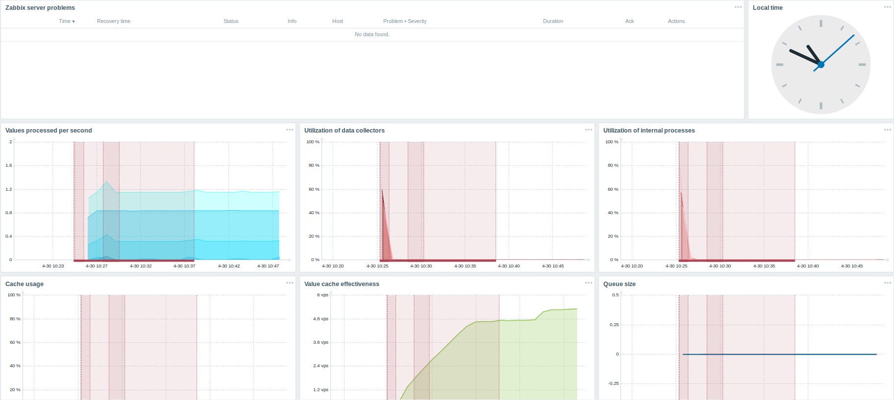
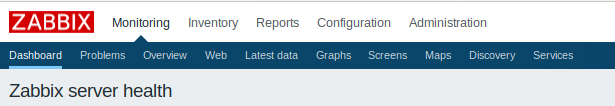

# Trabajo idp tema 9

## Monitorizar una red

1º Iniciamos el servidor local como ya hemos visto antes

2º La monitorización de la red en la que se encuentra en nuestro servido nos aparecerá en pantalla

3º En caso de que ya esté abierto el programa, la monitorización se encuentra en el apartado Monitoring y después Dashboard.

Es importante puntualizar que se necesita tiempo para obtener resultados  