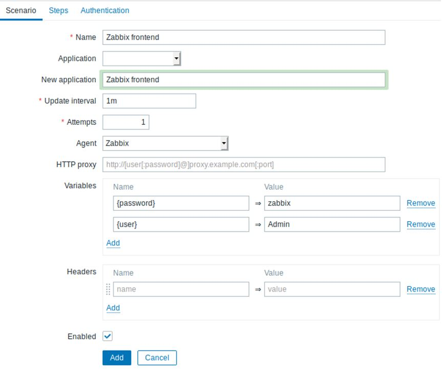
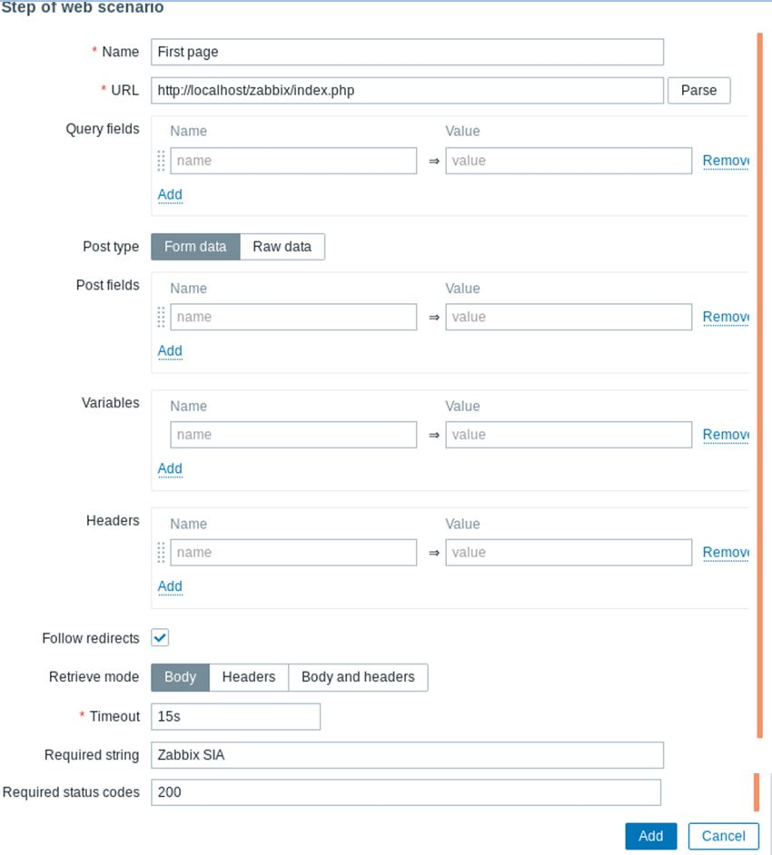
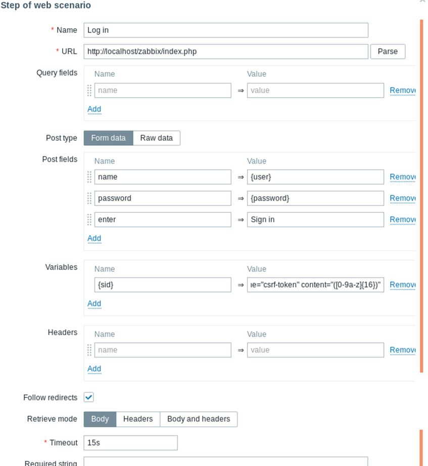
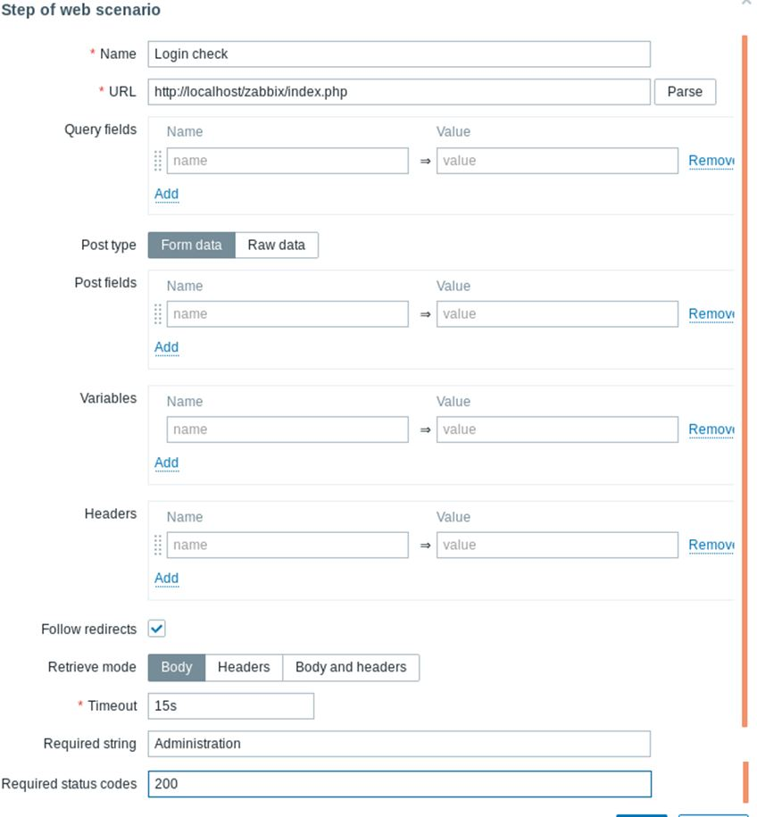
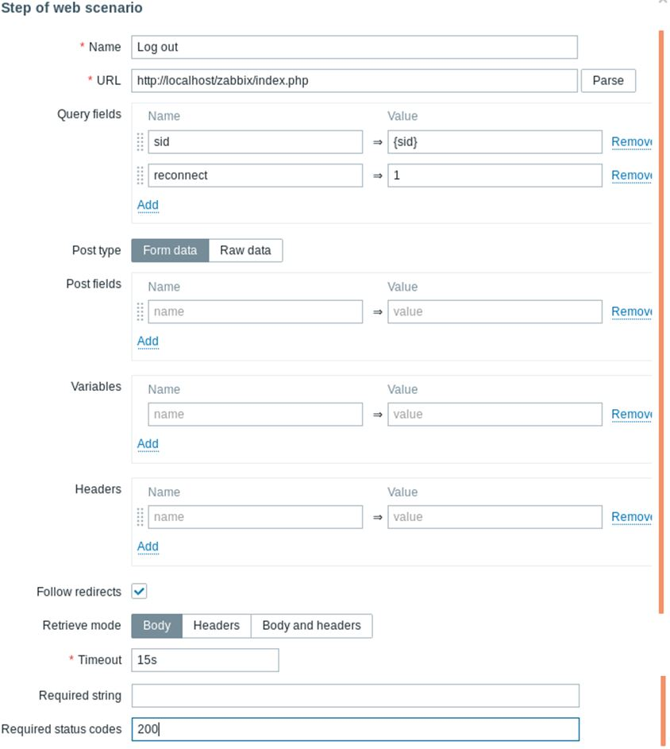
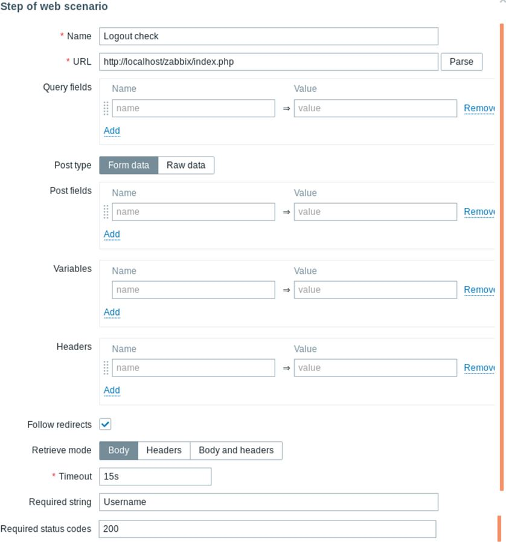
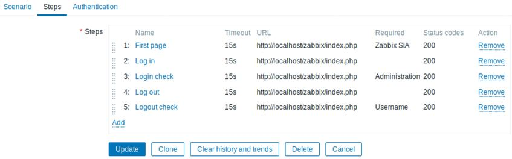
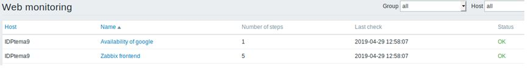
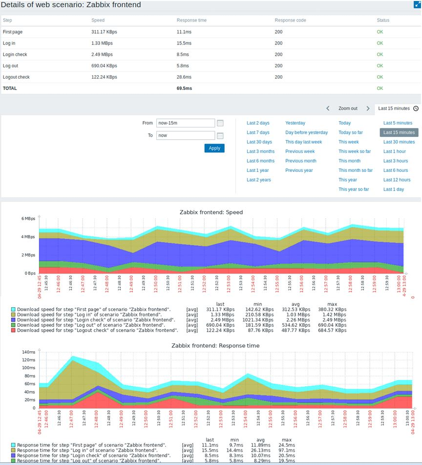

# Monitorizar un sitio web con Zabbix

A continuación explicamos como monitorizar la misma web de administración de Zabbix. Queremos saber si está disponible, si proporciona el contenido correcto y con qué rapidez funciona. Para hacerlo, también debemos iniciar sesión con nuestro nombre de usuario y contraseña.

1º Añadir un escenario. Vamos a Configuración → Hosts , elegimos un host y hacemos clic en Web. Luego hacemos clic en "Crear Escenario Web".

2º Definir los pasos para el escenario.

3º Continuamos iniciando sesión en la interfaz de Zabbix, y lo hacemos reutilizando las macros (variables) que definimos en el nivel de escenario: {usuario} y {contraseña}.

4º Definimos tambien la expresión regular `regex:name="csrf-token" content="([0-9a-z]{16})"` que necesitaremos más tarde.

5º Al iniciar sesión, debemos verificar el hecho. Para hacerlo, verificamos una cadena que solo sea visible cuando inicie sesión, por ejemplo, Administración.

6º Ahora que hemos verificado que se puede acceder a la interfaz y que podemos iniciar sesión y recuperar el contenido registrado, también debemos cerrar sesión; de lo contrario, la base de datos de Zabbix se contaminará con muchos registros de sesiones abiertas

7º También podemos verificar que hemos cerrado sesión buscando la cadena de nombre de usuario.

8º Y así debería quedar el escenario de pasos.

9º El escenario aparecerá en Monitorización → Web.

10º Hacemos clic en el nombre del escenario para ver estadísticas más detalladas.

